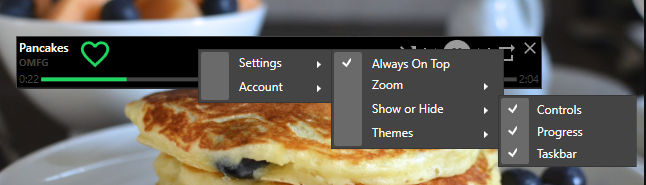

#  Pancake Player 

A short, wide ui that you can use to control the playback for Spotify.

## Installation

If you don't already have .Net 6 installed, [you'll need to install it](https://dotnet.microsoft.com/en-us/download/dotnet/6.0).

Then download the latest version from [the Releases page](https://github.com/hoooknew/pancake-spotify-player/releases) and either run the msi, or extract the zip file.

Settings are store in `<local app data>/pancake`.

## Setup

When the app first starts, you'll need to click the sign in button. 

You'll be prompted with firewall warning. It can be canceled. 
> To sign in, the app starts up a local web server just for sign in to get back the credentials needed to access Spotify.

The app will open a Spotify authorization page in your default web browser. That app will work after you approve.

## Settings

All the settings can be accessed in a context menu that you can open with a right click on the app.

